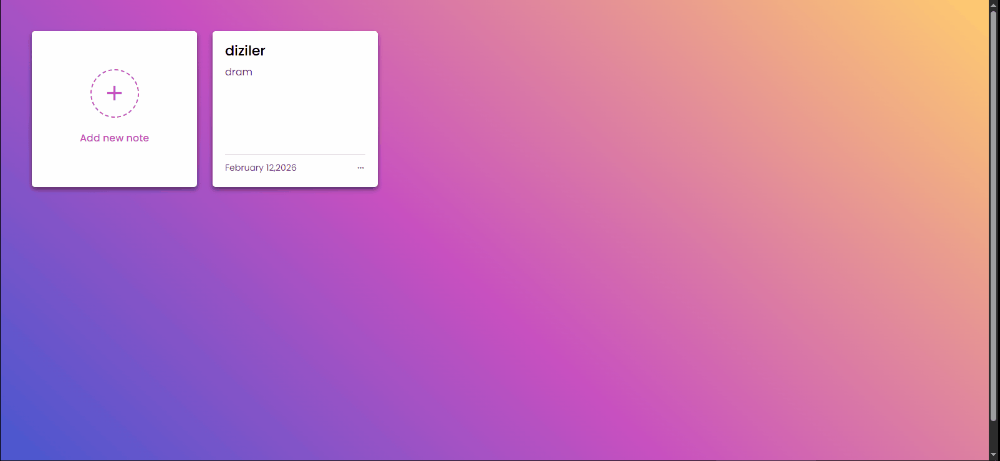

# 🏠 Note Keeper

In this repository, a real-time notepad has been designed using HTML, CSS, and JavaScript. It allows users to manage notes with titles and descriptions by editing or deleting them. The application keeps dates updated, and all data is stored in local storage for persistence.

## 🚀 Features

- Responsive Design
- User-Friendly Interface
- Modular Coding
- Edit and Delete Notes
- Persistent Data with Local Storage

## 🛠️ Technologies Used

- HTML
- CSS
- JavaScript

## 📸 Project Preview

